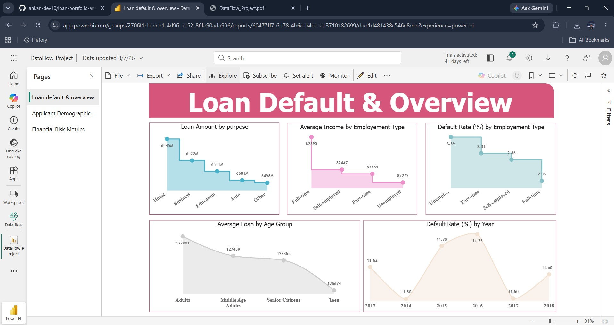
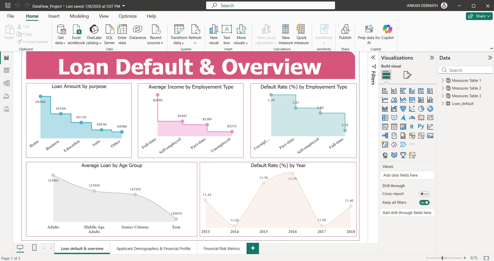
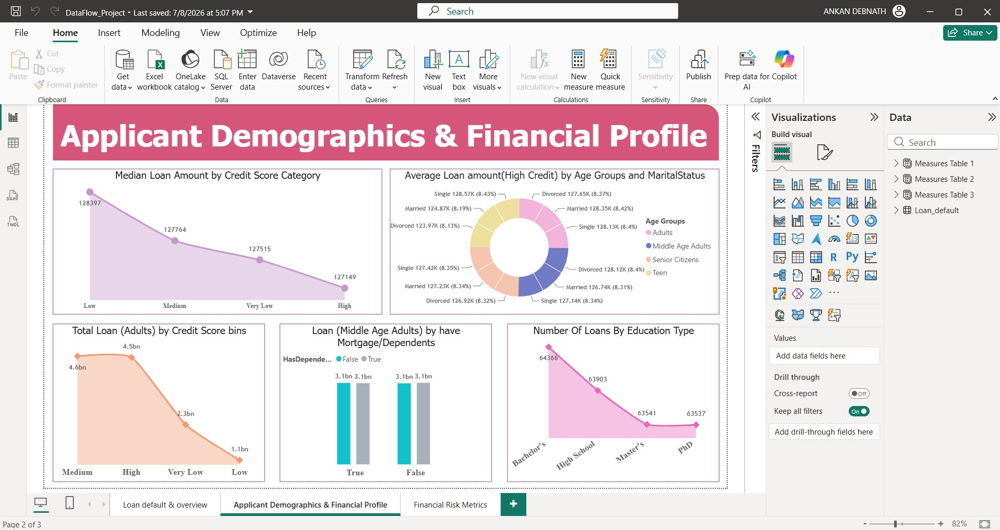
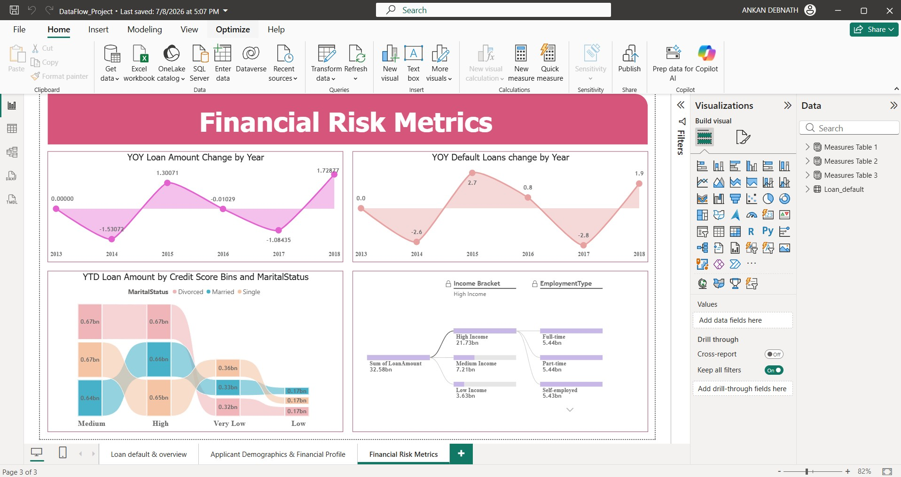

# Loan-Portfolio-Analytics-Dashboard

### Dashboard Link : https://app.powerbi.com/links/3KNBdW1zzK?ctid=e93d71d6-b5c0-4b78-a861-d9964ecdfcd6&pbi_source=linkShare

## Problem Statement

This dashboard helps financial institutions understand their loan portfolio better. It enables stakeholders to analyze customer demographics, loan purposes, credit behavior, and default patterns.

Through different KPIs and analytical measures, organizations can identify high-risk customer segments, monitor portfolio growth trends, and make data-driven lending decisions.

Since default rates vary across employment categories and credit segments, institutions can identify areas requiring risk mitigation strategies.

Additionally, Year-over-Year (YOY) and Year-to-Date (YTD) analyses provide insights into portfolio growth and lending performance.

---

### Steps followed

- Step 1 : Imported the dataset into Microsoft SQL Server.

- Step 2 : Downloaded and configured On-Premises Data Gateway.

- Step 3 : Created Power BI Dataflows in Power BI Service and connected SQL Server as the data source.

- Step 4 : Imported Dataflows into Power BI Desktop.

- Step 5 : Opened Power Query Editor and enabled:

      (a) Column Quality
      (b) Column Distribution
      (c) Column Profile

- Step 6 : Since profiling by default considers only the first 1000 rows, "Column profiling based on entire dataset" was selected.

- Step 7 : Performed data validation and checked for null values, inconsistent records, and data quality issues.

- Step 8 : Created relationships and developed the data model.

- Step 9 : Created analytical measures using DAX functions such as:

      (a) CALCULATE()
      (b) FILTER()
      (c) SUMX()
      (d) AVERAGEX()
      (e) MEDIANX()
      (f) DIVIDE()
      (g) ALLEXCEPT()
      (h) DATESYTD()

- Step 10 : Visual filters (Slicers) were added for:

      (a) Employment Type
      (b) Marital Status
      (c) Credit Score Category
      (d) Education Type
      (e) Year

- Step 11 : Multiple visuals were created including:

      (a) Donut Charts
      (b) Clustered Column Charts
      (c) Line Charts
      (d) Decomposition Tree
      (e) KPI Cards

- Step 12 : Following DAX expression was written to calculate Average Income by Employment Type,

```DAX
Average Income by Employement Type =
CALCULATE(
    AVERAGE(Loan_default[Income]),
    ALLEXCEPT(
        Loan_default,
        Loan_default[EmploymentType]
    )
)
```

- Step 13 : Following DAX expression was written to calculate Loan Amount by Purpose,

```DAX
Loan Amount by purpose =
SUMX(
    FILTER(
        Loan_default,
        NOT(ISBLANK(Loan_default[LoanAmount]))
    ),
    Loan_default[LoanAmount]
)
```

- Step 14 : Following DAX expression was written to calculate Default Rate by Employment Type,

```DAX
Default Rate By Employement type =

VAR totalrecords =
COUNTROWS(ALL(Loan_default))

VAR Defaultcases =
COUNTROWS(
    FILTER(
        Loan_default,
        Loan_default[Default]=TRUE()
    )
)

RETURN

CALCULATE(
    DIVIDE(Defaultcases,totalrecords),
    ALLEXCEPT(
        Loan_default,
        Loan_default[EmploymentType]
    )
) * 100
```

- Step 15 : Following DAX expression was written to calculate Year-over-Year Loan Amount Change,

```DAX
YOY Loan Amount Change =
DIVIDE(
    CALCULATE(
        SUM(Loan_default[LoanAmount]),
        Loan_default[Year] =
        YEAR(MAX(Loan_default[Loan_Date_DD_MM_YYYY]))
    )
    -
    CALCULATE(
        SUM(Loan_default[LoanAmount]),
        Loan_default[Year] =
        YEAR(MAX(Loan_default[Loan_Date_DD_MM_YYYY]))-1
    ),

    CALCULATE(
        SUM(Loan_default[LoanAmount]),
        Loan_default[Year] =
        YEAR(MAX(Loan_default[Loan_Date_DD_MM_YYYY]))-1
    ),

0) *100
```

- Step 16 : Following DAX expression was written to calculate Year-to-Date Loan Amount,

```DAX
YTD Loan Amount =
CALCULATE(
    SUM(Loan_default[LoanAmount]),
    DATESYTD(
        Loan_default[Loan_Date_DD_MM_YYYY].[Date]
    ),
    ALLEXCEPT(
        Loan_default,
        Loan_default[Credit Score Bins],
        Loan_default[MaritalStatus]
    )
)
```

- Step 17 : Configured Scheduled Refresh and Incremental Refresh.

- Step 18 : The report was then published to Power BI Service.

---

# Snapshot of Dashboard (Power BI Service)



---

# Report Snapshot (Power BI Desktop)

## Page 1 : Loan Default & Overview



## Page 2 : Applicant Demographics & Financial Profile



## Page 3 : Financial Risk Metrics



---

# Insights

A three-page report was created on Power BI Desktop and it was then published to Power BI Service.

Following inferences can be drawn from the dashboard;

### [1] Loan Amount by Purpose

    Home Loans      : 6545M
    Business Loans  : 6522M
    Education Loans : 6511M
    Auto Loans      : 6501M
    Other Loans     : 6498M

Thus, maximum loan amount was observed for Home loans.

---

### [2] Average Income by Employment Type

    Full Time      : 82.89K
    Self Employed  : 82.44K
    Part Time      : 82.38K
    Unemployed     : 82.27K

Thus, Full-Time employees possess the highest average income.

---

### [3] Default Rate by Employment Type

    Unemployed     : 3.39 %
    Part Time      : 3.01 %
    Self Employed  : 2.86 %
    Full Time      : 2.36 %

Thus, unemployed applicants exhibit the highest default rates.

---

### [4] Average Loan by Age Group

    Adults              : 127.90K
    Middle Age Adults   : 127.46K
    Senior Citizens     : 127.35K
    Teen                : 126.67K

Thus, adult customers maintain the highest average loan amount.

---

### [5] Median Loan Amount by Credit Score Category

    Low       : 128.40K
    Medium    : 127.76K
    Very Low  : 127.51K
    High      : 127.15K

Thus, lower credit score segments have comparatively higher median loan amounts.

---

### [6] Number of Loans by Education Type

    Bachelor's  : 64.36K
    High School : 63.90K
    Master's    : 63.54K
    PhD         : 63.53K

Thus, Bachelor's degree holders account for the maximum number of loans.

---

### [7] YOY Loan Amount Change

Significant fluctuations in loan growth are observed across years.

---

### [8] YOY Default Loan Change

Default trends vary considerably across years.

---

### [9] Decomposition Tree Analysis

    Total Loan Portfolio : 32.58 bn

    High Income Segment   : 21.73 bn
    Medium Income Segment : 7.21 bn
    Low Income Segment    : 3.63 bn

Thus, high-income customers contribute the largest share of the loan portfolio.
